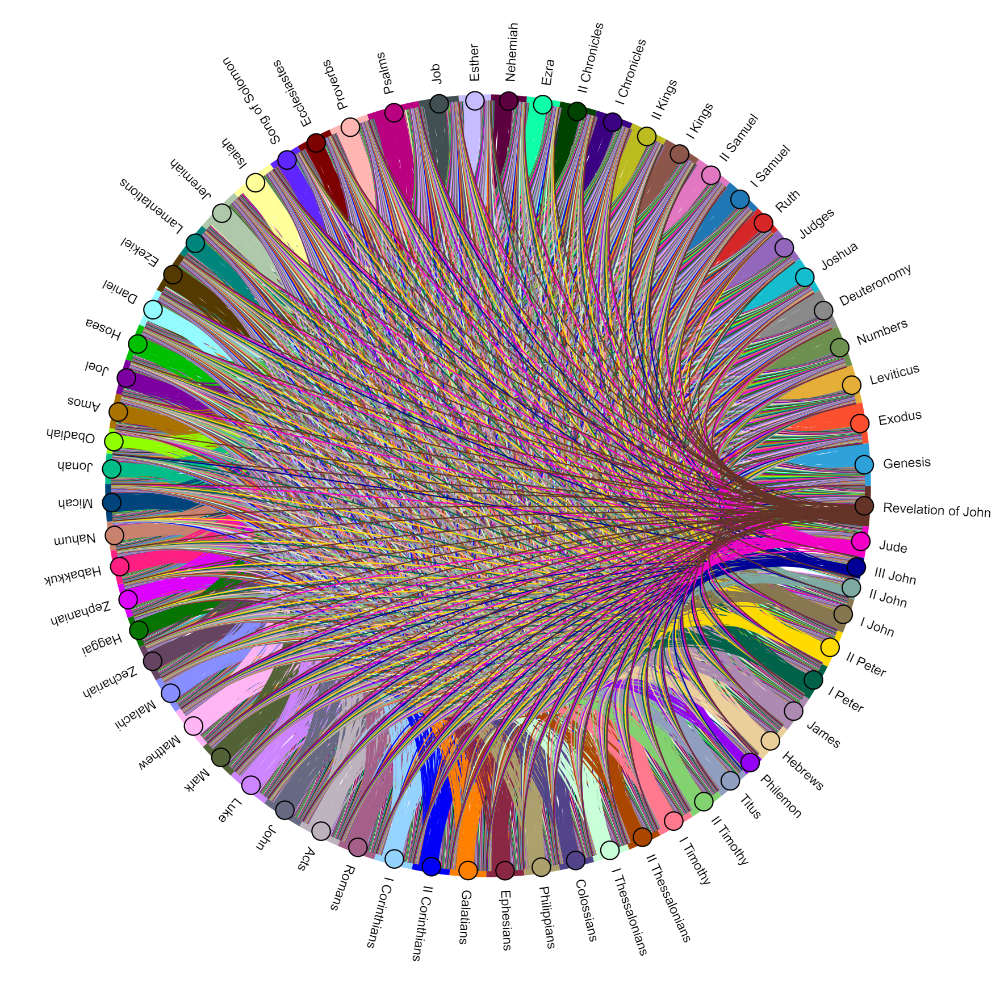

# BibleStatsVisualizer

This is a small personal project made to try out some Python stuff while visualizing different aspects of the Bible. The inspiration of this project is this cross reference visualization prject by [Chris Harrison](https://www.chrisharrison.net/index.php/visualizations/BibleViz).

## Data

The data consists of a [JSON file](https://github.com/scrollmapper/bible_databases/tree/master/sources/en/KJV) containing the KJV translation of the Bible from [scrollmapper's bible_databases](https://github.com/scrollmapper/bible_databases) repository. and a plain text file containing cross references for every verse (if applicable) in the Bible by [openbible](https://www.openbible.info/labs/cross-references/). The JSON file download can be found in the link in "JSON file", and the plain text file download can be found at the bottom of the page linked in "openbible". Please note that this version of the Bible only has 66 books. I am aware that some denominations have more or less books, but this is the Bible version that I am using.

## Python and Library Versions

For this repository, I am using Python 3.13.3. For installing the necessary modules, you can check out the [requirements.txt](requirements.txt) file. The following command worked for me as well:
```python
pip install pandas, hololive 
```

That should install all the dependencies as well.

## Book to Book References

I define book to book references as a reference of any verse from one book in a verse in another. So for example, in the data, it says that Genesis 1:1 has a reference to Romans 1:19 and Romans 1:20. For the purposes of book to book references, this is two references of Romans in Genesis. This allows the data to be much simpler to deal with, and the resulting visuals to not be so cluttered. So far, three images have been made, including this chord diagram:



All three images are chord diagrams in fact. They are created in the [book_to_book_references.ipynb](book_to_book_references.ipynb) notebook. The outputs are not shown in the notebook preview, so you will have to download the notebook and execute the cells yourself.
